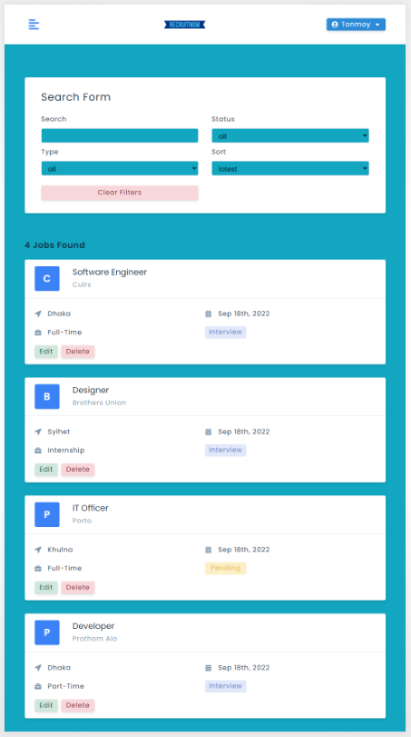

---

# Recruit-Now 

An online job portal web application that can help users to find jobs according to their credentials. A user can also add a job and delete it from his particular account. A user can also search for jobs and see the current status of that job by status, type, and sort. I have used HTML, CSS, JavaScript, React.js, Redux, and Axios in this project.  

